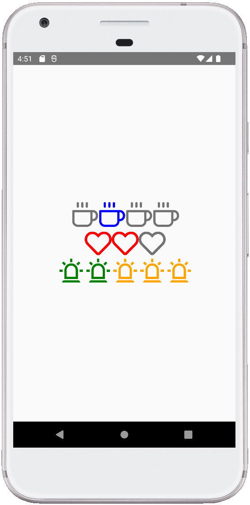

# React Native Icon Progress Step

---

A module that allows to use progress step with icons from react-native-vector-icons's package.

Bundled Icon Sets
-

---
- AntDesign,
- EntIcon,
- FeatherIcon,
- FontAwesome,
- FontAwesome5,
- Fontisto,
- Ionicons,
- MaterialCommunityIcons,
- MaterialIcons,
- Octicons,

Easy-to-use
-
---

    import {View, StyleSheet, ViewStyle} from 'react-native';
    import React from 'react';
    import ProgressIcons from './components/ProgressIcons';
    
    const App = () => {
      const activeIconIndex = 1;
    
      return (
        <View style={styles.container}>
          <ProgressIcons
            activeIcon={activeIconIndex}
            library="FeatherIcon"
            name="coffee"
            size={50}
            color="blue"
            completedIconColor="light_gray">
            <></>
            <></>
            <></>
            <></>
          </ProgressIcons>
          
          <ProgressIcons
            activeIcon={activeIconIndex}
            library="FontAwesome5"
            name="heart"
            size={50}
            color="red">
            <></>
            <></>
            <></>
          </ProgressIcons>
          
          <ProgressIcons
            activeIcon={activeIconIndex}
            library="MaterialCommunityIcons"
            name="alarm-light-outline"
            size={50}
            color="green"
            nonActiveIconColor="orange">
            <></>
            <></>
            <></>
            <></>
            <></>
          </ProgressIcons>
        </View>
      );
    };

    export default App;
    
    const styles = StyleSheet.create({
      container: {
        height: '100%',
        justifyContent: 'center',
        alignItems: 'center',
      },
    });
  

